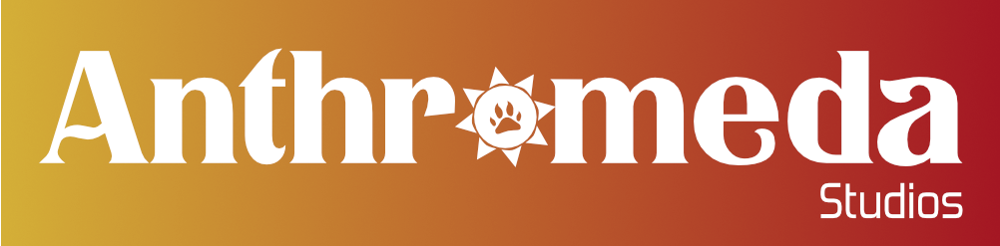

# Who Are We?
We are an independent organization working to make the world better by listening to people needs and then make open source tools that answers them.
Anthromeda also works in board game design, as well as selling goodies/hoodies ([https://anthromeda.shop](https://anthromeda.shop)).

# Main Projects
- **Diversy**: A modern and web-based social platform meant for a brighter and all-in-one usage including a marketplace for artists/professionals, the abiliy to custom your profile (free banner, host character sheets, custom CSS, etc.) and join diverse communities like does Reddit in which you find wikis, forums and real-time chat.
- **Shelter**: Meant to be a secure by design, privacy-first encrypted networking protocol, it first starts as an encrypted messaging sysrtem built on top of the UDP protocol.
